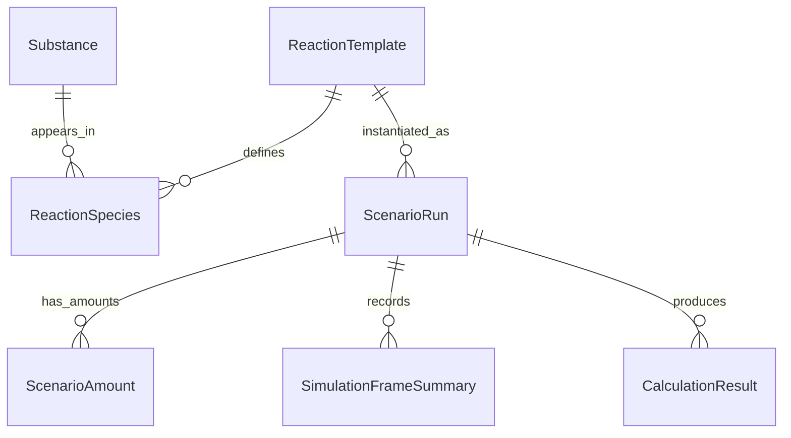

# PRD: cheMystry (Desktop MVP)

- Date: 2026-03-04
- Product: cheMystry
- PRD Owner: Product + Engineering
- Target Release: MVP (desktop) after 4 milestones

## 1. App Overview and Goals

### 1.1 Product Vision
cheMystry is a desktop application for visualizing chemical processes in 3D with interactive controls over reaction conditions (temperature, pressure, gas medium) and built-in stoichiometric calculations.  
The core value for MVP is: "assemble a reaction manually, run a realistic-enough simulation, and quickly answer 'what happens if I change conditions?'"

### 1.2 Problem Statement
Students often see chemistry as static formulas and tables. Existing tools are either:
- too simplified (weak physical realism), or
- too complex/expensive for everyday learning.

MVP should close this gap with a practical simulation tool focused on clarity, interactivity, and quantitative checks.

### 1.3 Primary Goals (MVP)
- Provide manual reaction assembly as the main workflow.
- Render dynamic 3D reaction visualization with interactive camera.
- Model environment effects (T/P/gas medium) with semi-realistic behavior.
- Support core chemistry calculations (stoichiometry, limiting reagent, yield, unit conversions, concentration).
- Work fully offline with local data and file import/export.

### 1.4 Non-Goals (MVP)
- No cloud collaboration.
- No user accounts/auth.
- No paid APIs/libraries as hard dependencies.
- No claim of publication-grade quantum chemistry accuracy in v1.

## 2. Target Audience

### 2.1 Primary Segment
- Chemistry students (undergraduate/graduate level).

### 2.2 Secondary Segments
- Researchers (as exploratory "what-if" sandbox).
- Chemistry enthusiasts.

### 2.3 User Value for Primary Segment
- Understand reaction behavior visually and quantitatively.
- Learn links between conditions and outcomes.
- Validate homework/lab assumptions quickly.

## 3. Platform and Distribution

- Platform for MVP: Desktop app.
- OS coverage: Linux, Windows, macOS.
- Optimization priority: Linux > Windows > macOS.
- Delivery model: local-first, offline-capable app.

## 4. Core Features and Functionality (MVP Scope)

## 4.1 Manual Reaction Builder (Primary Mode)

Description:
- User assembles reactants/products manually.
- Defines initial amounts, phases, and reaction conditions.
- Launches simulation from constructed setup.

Acceptance Criteria:
- User can add/edit/remove substances in a reaction setup.
- User can set initial amount as mass, moles, or volume (where applicable).
- Reaction setup validates before run (missing coefficients/units/errors shown clearly).
- User can start, pause, reset simulation from the same screen.

Technical Considerations:
- Keep UI state independent from simulation engine state (explicit sync boundary).
- Use deterministic input schema for simulation jobs (stable serialization).

## 4.2 Preset Library (Secondary Mode)

Description:
- Ready-to-run reaction presets for quick start and learning.
- Presets are editable and can become manual scenarios.

Acceptance Criteria:
- At least one preset per reaction class in MVP:
  - basic inorganic
  - acid-base
  - redox
  - basic organic
  - equilibrium
- User can load preset in one click and modify it.
- Presets support metadata (name, class, difficulty, notes, source).

Technical Considerations:
- Presets stored locally and versioned for future schema migrations.

## 4.3 3D Reaction Visualization + Interactive Camera

Description:
- Central 3D scene with molecules/particles, bond visualization, and reaction progression.
- Full camera interaction: orbit, pan, zoom, focus.

Acceptance Criteria:
- Camera supports smooth orbit/pan/zoom and reset-to-default.
- User can select objects and inspect key metadata.
- Simulation state changes are reflected in scene in near real-time.
- Scene remains responsive under default profile settings.

Technical Considerations:
- Separate render loop and simulation step loop (time-step governance).
- Introduce LOD/quality toggles and particle caps for stable FPS.

## 4.4 Environment Controls (Temperature, Pressure, Gas Medium)

Description:
- User can modify T, P, and medium composition and observe impact.

Acceptance Criteria:
- T and P are editable during setup and optionally during run (if model allows).
- Model visibly and numerically updates derived properties (e.g., gas volume trends).
- UI shows current and baseline values for easy comparison.

Technical Considerations:
- Use clear "model assumptions" panel so users see approximation limits.
- Keep formula and constants source traceable for auditability.

## 4.5 Chemistry Calculations Engine

MVP must include all requested calculation groups:
- Stoichiometry by balanced equation.
- Limiting reagent.
- Theoretical/actual yield + % yield.
- Mass <-> moles <-> gas volume conversions under T/P.
- Basic solution concentration (mol/L).

Acceptance Criteria:
- For valid input, all listed calculations return results with units.
- For invalid/incomplete input, user gets actionable validation messages.
- Unit conversions are consistent across all calculator panels.
- Result panel can be exported with scenario metadata.

Technical Considerations:
- Calculation module should be pure/deterministic and test-first.
- Shared unit system + dimensional checks to prevent silent mistakes.

## 4.6 Local Data + File Import/Export

Description:
- Fully local storage.
- Import and export in prioritized common formats.

MVP format priority:
- SDF/MOL
- SMILES
- XYZ

MVP export target:
- SDF/MOL
- SMILES

Acceptance Criteria:
- User can import each format above through desktop file picker.
- Parser reports parsing errors with line/context when possible.
- Export supports SDF/MOL and SMILES in MVP.
- Imported structures become available in local substance library.

Technical Considerations:
- XYZ usually lacks explicit bond info; app must infer bonds and mark confidence.
- File parsing must run with size limits and safe validation.

## 4.7 Settings: Precision/Performance Profiles

Description:
- App ships with balanced default profile.
- Advanced users can increase particle limits and precision.

Acceptance Criteria:
- Default profile is "Balanced" (recommended).
- User can adjust target FPS limit and particle caps.
- User can switch simulation precision profile without app restart.
- UI clearly warns when selected settings may reduce stability/performance.

Technical Considerations:
- Keep adaptive degradation strategy (reduce visual detail before breaking UX).
- Persist settings locally per device.

## 5. Technical Stack Recommendation

## 5.1 Recommended Stack (MVP)

- App shell: Tauri v2
- Frontend: React + TypeScript
- 3D: Three.js via React Three Fiber
- Core simulation/calculations: Rust modules
- Physics engine baseline: Rust-native engine (e.g., Rapier) + chemistry-specific logic layer
- Local storage: SQLite + local files (JSON for presets/import metadata)

Rationale:
- Tauri keeps desktop app lightweight and cross-platform.
- Rust is suitable for deterministic/high-performance simulation logic.
- React + R3F speeds up UI/3D iteration while preserving flexibility.
- SQLite fits offline-first local data with robust querying.

## 5.2 Alternatives Considered

Electron + React:
- Pros: large ecosystem, fast prototyping.
- Cons: larger runtime footprint, less aligned with Rust-heavy simulation core.

Fully native UI stack:
- Pros: max low-level control/performance.
- Cons: slower UI iteration and higher MVP complexity.

Recommendation:
- Keep Tauri + React + Rust as selected architecture.

## 5.3 External Integration Points (MVP and Near-MVP)

- Local import: SDF/MOL, SMILES, XYZ.
- Local export (MVP): SDF/MOL, SMILES.
- Future optional sync/provider connectors: PubChem-style structures, extended chem formats.

No paid services are mandatory for MVP.

## 6. Conceptual Data Model

## 6.1 Entities

### Substance
- `id: UUID`
- `name: string`
- `formula: string`
- `smiles: string | null`
- `molar_mass_g_mol: number`
- `phase_default: enum(solid, liquid, gas, aqueous)`
- `source_type: enum(builtin, imported, user_defined)`
- `created_at: datetime`

### ReactionTemplate
- `id: UUID`
- `title: string`
- `reaction_class: enum(inorganic, acid_base, redox, organic_basic, equilibrium)`
- `equation_balanced: string`
- `description: string`
- `is_preset: boolean`
- `version: integer`

### ReactionSpecies
- `id: UUID`
- `reaction_template_id: UUID`
- `substance_id: UUID`
- `role: enum(reactant, product, catalyst, inert)`
- `stoich_coeff: number`

### ScenarioRun
- `id: UUID`
- `reaction_template_id: UUID | null`
- `name: string`
- `temperature_k: number`
- `pressure_pa: number`
- `gas_medium: string`
- `precision_profile: enum(balanced, high_precision, custom)`
- `fps_limit: integer`
- `particle_limit: integer`
- `created_at: datetime`

### ScenarioAmount
- `id: UUID`
- `scenario_run_id: UUID`
- `substance_id: UUID`
- `amount_mol: number | null`
- `mass_g: number | null`
- `volume_l: number | null`
- `concentration_mol_l: number | null`

### SimulationFrameSummary
- `id: UUID`
- `scenario_run_id: UUID`
- `t_sim_s: number`
- `key_metrics_json: json`

### CalculationResult
- `id: UUID`
- `scenario_run_id: UUID`
- `result_type: enum(stoichiometry, limiting_reagent, yield, conversion, concentration)`
- `payload_json: json`
- `created_at: datetime`

### ImportJob
- `id: UUID`
- `format: enum(sdf_mol, smiles, xyz)`
- `file_path: string`
- `status: enum(success, failed, partial)`
- `warnings_json: json`
- `created_at: datetime`

## 6.2 Relationship Overview



## 7. UI/UX Principles

## 7.1 Layout
Primary 3-panel layout:
- Left panel: substance library + manual reaction builder + presets.
- Center panel: 3D scene and timeline controls.
- Right panel: environment controls + calculators + result summaries.

## 7.2 UX Rules
- Manual assembly is default landing flow.
- Presets are quick-start shortcuts, not the main path.
- Every editable numeric input shows units.
- Validation and warnings must be immediate and understandable.

## 7.3 Interaction Quality
- Smooth camera controls with keyboard/mouse shortcuts.
- Fast scenario iteration controls (save/reset/rewind baseline values).
- Clear indication of model confidence/approximation limits.

## 7.4 Accessibility (MVP baseline)
- Scalable UI text.
- Colorblind-safe palette options for atom/bond coloring.
- Keyboard-accessible major controls.

## 8. Security and Privacy Considerations

Context:
- No login/auth in MVP.
- Local-first application with file import.

Required controls:
- Strict input validation for all imported files.
- Restrictive Tauri capabilities/permissions (least privilege).
- IPC boundary hardening: explicit command contracts, reject malformed payloads.
- CSP in Tauri config with minimal allowed sources.
- Avoid remote script loading/CDN runtime dependencies.
- Safe file handling (path normalization, file size limits, parser timeouts).

Privacy:
- User data stays local by default.
- No telemetry by default in MVP.

## 9. Scalability and Performance Requirements

Default behavior:
- Balanced mode is enabled by default.

User-tunable controls:
- Target FPS limit.
- Particle/entity caps.
- Precision profile (Balanced / High Precision / Custom).

Performance NFR targets (MVP):
- Reference hardware profile for acceptance baseline:
  - RAM: 16 GB
  - CPU: 8 cores
  - GPU: 4 GB VRAM
- Smooth interaction on mid-range hardware under Balanced profile.
- No UI freeze during heavy simulation steps (asynchronous execution boundary).
- Graceful degradation before hard failure (reduce detail first).

Cross-platform requirements:
- GPU path should be validated on Linux, Windows, macOS with platform-specific fallback strategy.

## 10. Milestones and Delivery Plan

## Milestone 1: Foundation (Core App Skeleton)
- Tauri + React + Rust monorepo structure.
- 3-panel shell UI.
- Local storage schema bootstrap.
- Basic molecule rendering scene with camera.

Exit Criteria:
- App launches on Linux dev environment.
- Core navigation and panel interactions work.

## Milestone 2: Reaction Builder + Calculations v1
- Manual reaction assembly.
- Stoichiometry, limiting reagent, conversions, yield, concentration modules.
- Validation UX and units system.

Exit Criteria:
- End-to-end run from manual input to validated calculation output.

## Milestone 3: Simulation + Environment Dynamics
- Semi-realistic simulation step model.
- Temperature/pressure/gas medium controls integrated.
- Balanced profile defaults + settings for fps/particles/precision.

Exit Criteria:
- User can run "what-if" scenarios and observe stable visual + numeric updates.

## Milestone 4: Import/Export + Presets + Hardening
- Import: SDF/MOL, SMILES, XYZ.
- Export: SDF/MOL, SMILES.
- Preset library across all 5 reaction classes.
- Error handling, performance tuning, security hardening.
- Cross-platform smoke testing.

Exit Criteria:
- MVP quality gate passed for core scenarios and offline workflow.

## 11. Potential Risks and Mitigations

Risk 1: 3D performance degradation on complex scenes.
- Mitigation: LOD, particle caps, adaptive quality, async computation pipeline.

Risk 2: Physical model feels too poor for "real product" expectations.
- Mitigation: publish model assumptions, confidence indicators, iterative model refinement backlog.

Risk 3: Import format inconsistencies and parser instability.
- Mitigation: strict parser boundaries, informative error diagnostics, quarantine partial imports.

Risk 4: Cross-platform GPU behavior differences.
- Mitigation: matrix testing, fallback rendering modes, driver-specific compatibility notes.

Risk 5: Scope overload in MVP.
- Mitigation: freeze non-critical features and enforce milestone acceptance gates.

## 12. Future Expansion Opportunities

- Higher scientific accuracy modes (advanced kinetics/thermodynamics models).
- Extended chemistry file formats and reaction datasets.
- Side-by-side scenario compare mode (A/B) for condition analysis.
- Scenario sharing and reproducible experiment bundles.
- Optional cloud sync and collaboration.
- Instructor mode (guided tasks, assessment packs).
- Plugin system for custom reaction models.

## 13. Feature Acceptance Summary (Checklist)

- [ ] Manual reaction builder supports full setup-edit-run cycle.
- [ ] 3D scene and camera are interactive and stable.
- [ ] Environment controls influence visual and numerical results.
- [ ] All required chemistry calculations are available with correct units.
- [ ] Presets exist for all 5 reaction classes.
- [ ] Import works for SDF/MOL, SMILES, XYZ.
- [ ] Export works for SDF/MOL and SMILES.
- [ ] Settings include FPS, particle limits, precision profile.
- [ ] App runs offline without auth.

## 14. Algorithmic Notes (Pseudocode-Level)

## 14.1 Limiting Reagent Flow

```text
Input: balanced reaction, initial amounts (mol) for reactants
For each reactant:
  normalized_amount = initial_mol / stoich_coeff
limiting_reagent = reactant with minimum normalized_amount
max_reaction_extent = min(normalized_amounts)
For each species:
  delta_mol = stoich_coeff * max_reaction_extent * sign(role)
Output: remaining reactants, produced products, theoretical yield
```

## 14.2 XYZ Bond Inference (Approximation)

```text
Input: atom list with coordinates and element types
For each atom pair (i, j):
  d = distance(i, j)
  threshold = covalent_radius(i) + covalent_radius(j) + tolerance
  if d <= threshold:
    create tentative bond with confidence score
Post-process:
  enforce basic valence sanity rules
  mark uncertain bonds for UI hinting
Output: inferred connectivity graph
```

## 15. References (Tech Validation)

- Tauri v2 docs: https://v2.tauri.app/
- Tauri IPC concept: https://v2.tauri.app/concept/inter-process-communication/
- Tauri calling Rust from frontend: https://v2.tauri.app/develop/calling-rust/
- Tauri CSP/security: https://v2.tauri.app/security/csp/
- React docs: https://react.dev/
- React Three Fiber docs: https://r3f.docs.pmnd.rs/getting-started/introduction
- Rapier docs: https://rapier.rs/docs/
- Open Babel common formats: https://openbabel.org/docs/FileFormats/Common_cheminformatics_Formats.html
- PubChem structure search help: https://pubchem.ncbi.nlm.nih.gov/search/help_search.html
- PubChem PC3D format notes (XYZ/SDF): https://pubchem.ncbi.nlm.nih.gov/pc3d/PC3DView1.html
- SQLite docs: https://sqlite.org/index.html
